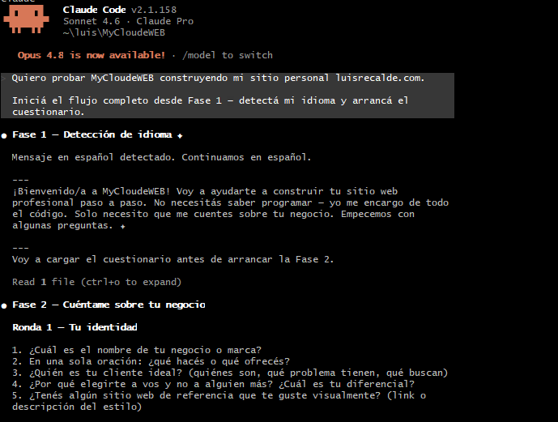
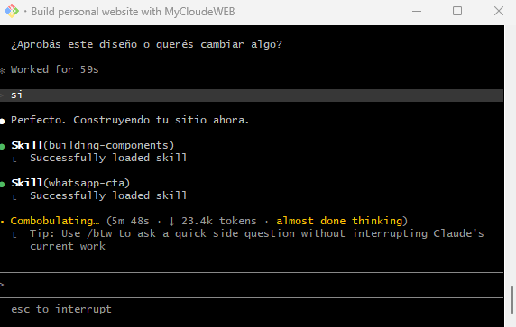
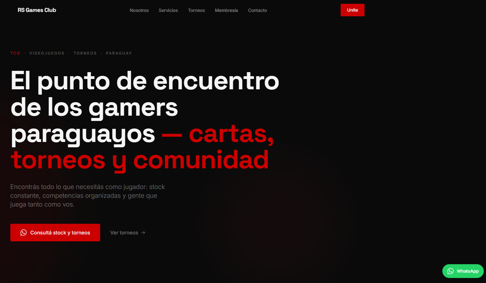
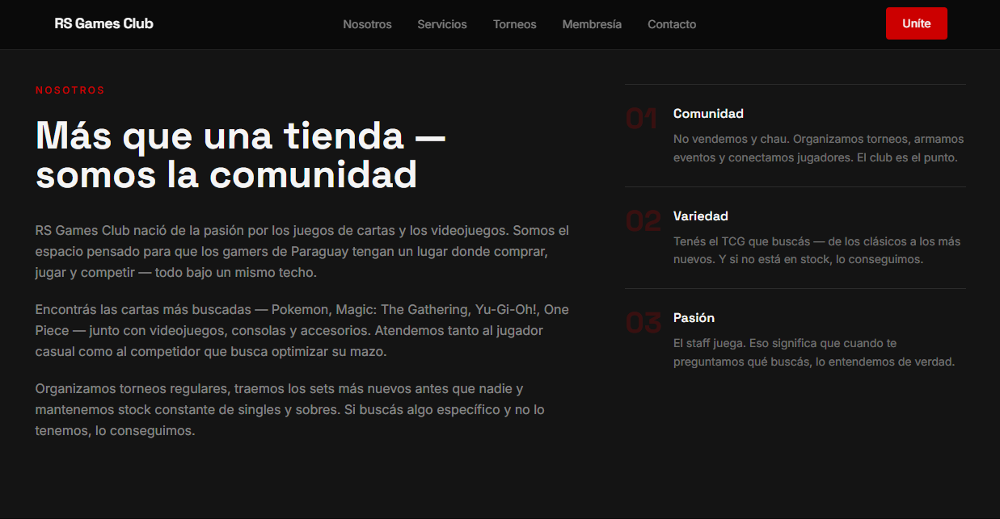
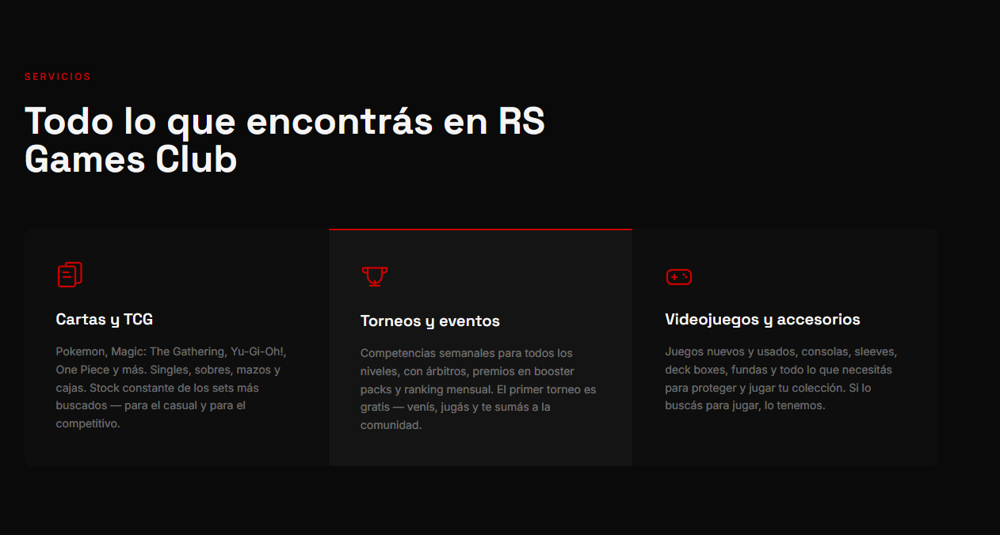
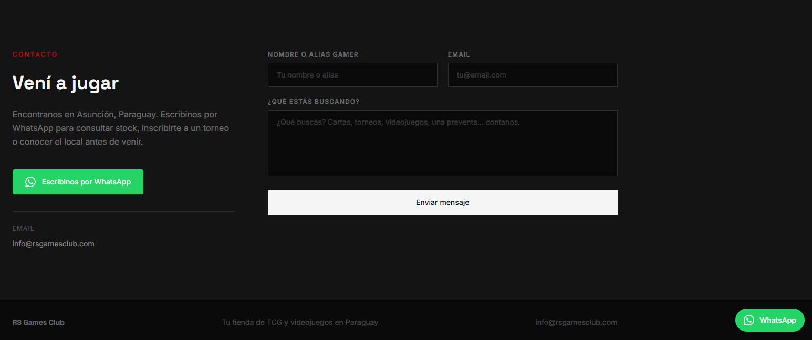

# MyCloudeWEB

[](https://opensource.org/licenses/MIT)
[](https://github.com/luis-recalde/MyCloudeWEB/stargazers)
[](https://github.com/luis-recalde/MyCloudeWEB/network/members)

**Tu sitio web profesional, en línea hoy. Sin código. Sin agencia. Sin esperar.**

Respondés algunas preguntas sobre tu negocio. La IA escribe el código, diseña el sitio y te guía hasta el deploy — todo en una sola sesión.

---

## Qué obtenés

- Un sitio web completo en **Next.js 14** con tu contenido real y tu identidad visual
- Sistema de diseño en **Tailwind CSS** adaptado a tu industria y estilo
- **Diseño responsivo** para móvil desde el primer momento
- **Metadatos SEO** configurados con la información de tu negocio
- Guía paso a paso para desplegarlo gratis en **Vercel**

---

## Demo

### El proceso


*La IA te guía en 4 rondas de preguntas — sin conocimiento técnico requerido.*


*Cuando aprobás el diseño, la IA escribe cada archivo. Vos no hacés nada.*

### El resultado — RS Games Club, construido con MyCloudeWEB


*Hero con identidad visual, paleta de colores y CTA personalizados para el negocio.*


*Sección sobre el negocio generada a partir de las respuestas del cuestionario — sin Lorem ipsum.*


*Sección de servicios con contenido real y layout elegido para la industria.*


*Sección de contacto con todos los canales provistos por el cliente, incluyendo WhatsApp.*

---

## Requisitos previos

Solo necesitás dos cosas instaladas:

- [Node.js 18+](https://nodejs.org) — el entorno de ejecución de JavaScript
- [Claude Code](https://claude.ai/code) — el asistente de código con IA

No se requiere experiencia en desarrollo web.

---

## Cómo usarlo

### 1. Cloná este repositorio

```bash
git clone https://github.com/luis-recalde/MyCloudeWEB.git
cd MyCloudeWEB
```

### 2. Abrí Claude Code

```bash
claude
```

O abrilo desde tu IDE o la app de escritorio de Claude.

### 3. Saludá

Solo escribí un mensaje en tu idioma — español o inglés — y la IA se encarga del resto.

Ejemplos:
- *"Hola, quiero armar mi sitio web"*
- *"Hi, I want to build my website"*

### 4. Respondé las preguntas

La IA te va a hacer preguntas sobre tu negocio en 4 rondas cortas:
- Tu identidad de negocio y propuesta de valor
- Tu estilo visual y colores de marca
- Qué secciones y contenido querés
- Configuración técnica (dominio, idioma, analíticas)

No necesitás conocimiento técnico. Respondé en lenguaje natural.

### 5. Aprobá tu sistema de diseño

Antes de construir, la IA presenta un sistema de diseño completo — colores, tipografías y estructura de página — para que lo apruebes. Pedí cambios o aprobalo para continuar.

### 6. Esperá mientras construye

La IA genera todo el código, instala las dependencias y verifica que el build funcione. Vos no hacés nada.

### 7. Vista previa local

Abrí `http://localhost:3000` en tu navegador y revisá tu sitio.

### 8. Deploy en Vercel

La IA te guía para subir el código a GitHub y desplegarlo en el plan gratuito de Vercel. Tu sitio queda en línea en minutos.

---

## Estructura del proyecto

```
MyCloudeWEB/
├── CLAUDE.md                   # Instrucciones del agente IA (el cerebro)
├── docs/
│   ├── questionnaire-es.md     # Cuestionario de negocio (español)
│   ├── questionnaire-en.md     # Cuestionario de negocio (inglés)
│   ├── design-guide.md         # Paletas, tipografías y layouts
│   └── deploy-guide.md         # Guía de deploy en Vercel
├── README.md                   # README en inglés
└── README.es.md                # Este archivo
```

Cuando la IA construye tu sitio, crea una nueva carpeta con el nombre de tu negocio dentro de este directorio.

---

## Industrias cubiertas

La guía de diseño incluye paletas, tipografías y layouts adaptados para:

- Tecnología y SaaS
- Salud y bienestar
- Educación y coaching
- Gastronomía y hospitalidad
- Servicios profesionales (derecho, consultoría, finanzas)
- Servicios creativos (diseño, fotografía, branding)

---

## Idiomas

Toda la experiencia — preguntas, sistema de diseño y guía de deploy — funciona en español o inglés. El idioma se detecta automáticamente desde tu primer mensaje.

---

## Preguntas frecuentes

**¿Necesito saber programar?**
No. La IA escribe todo el código. Vos solo respondés preguntas sobre tu negocio.

**¿Es realmente gratis?**
Sí. Claude Code tiene un plan gratuito. El plan Hobby de Vercel también es gratuito y más que suficiente para un sitio profesional. Solo pagás si comprás un dominio propio.

**¿Puedo editar el código después?**
Sí. El código generado es Next.js + Tailwind estándar. Cualquier desarrollador puede mantenerlo y extenderlo.

**¿Qué pasa si quiero cambios después de que el sitio esté construido?**
Abrí Claude Code en la carpeta del proyecto generado y describí los cambios que querés en lenguaje natural.

---

## Contribuciones

Las contribuciones son bienvenidas. Así podés participar:

**Reportar un bug o sugerir una mejora**
Abrí un issue en [GitHub Issues](https://github.com/luis-recalde/MyCloudeWEB/issues). Describí qué pasó, qué esperabas que pasara y tu entorno (sistema operativo, versión de Node.js, versión de Claude Code).

**Enviar un pull request**
1. Hacé un fork del repositorio y creá una rama: `git checkout -b fix/nombre-del-fix`
2. Mantenés el PR enfocado en un solo cambio — pequeño y fácil de revisar
3. Abrís un pull request con una descripción clara de qué cambiaste y por qué

Para cambios grandes, abrí primero un issue para discutir el enfoque antes de escribir código.

---

## Licencia

MIT License — Copyright Luis Recalde 2026

Se otorga permiso, de forma gratuita, a cualquier persona que obtenga una copia de este software para usarlo, copiarlo, modificarlo, fusionarlo, publicarlo, distribuirlo, sublicenciarlo y/o venderlo, sujeto a que el aviso de copyright anterior y este aviso de permiso se incluyan en todas las copias o partes sustanciales del software.
